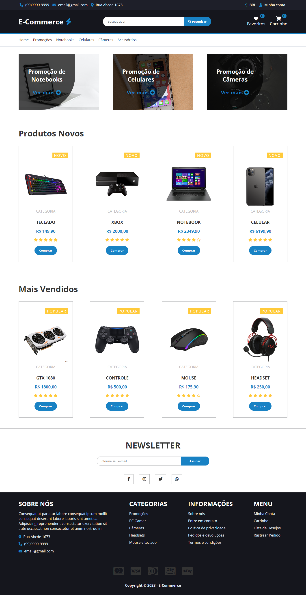

# E-Commerce Page
Este é um exemplo de página de e-commerce construída com Sass e seguindo a arquitetura SMACSS (Scalable and Modular Architecture for CSS). O objetivo deste projeto é demonstrar a estrutura de pastas, as tecnologias utilizadas e os recursos implementados na página.
<br>
<br>


# Recursos
A página de e-commerce implementa os seguintes recursos:

- **Seção de produtos:** A página inclui uma seção dedicada à exibição de produtos. Os estilos dessa seção são organizados dentro da pasta 2-layouts e são facilmente modificáveis. É possível adicionar mais produtos ou alterar a aparência da seção de acordo com as necessidades do projeto.
  
- **Botões personalizados:** A página utiliza estilos personalizados para os botões, que são definidos na pasta 3-modules. Isso permite criar botões com diferentes variações de cores, tamanhos e estilos, proporcionando uma aparência consistente em toda a página.
- **Rodapé e cabeçalho:** A página possui um cabeçalho e um rodapé personalizados, com estilos específicos definidos na pasta 2-layouts. Essas seções podem ser facilmente modificadas para adicionar links adicionais, informações de contato ou qualquer outro conteúdo relevante.
- **Layout responsivo:** A página é projetada para ser responsiva, ou seja, se adaptar a diferentes tamanhos de tela e dispositivos. São utilizados breakpoints para ajustar o layout conforme o tamanho da tela. Isso garante que a página seja visualizada corretamente em dispositivos móveis, tablets e desktops.
- **Utilização de Sass:** O projeto utiliza Sass como pré-processador CSS para escrever estilos de forma mais organizada e modular. Isso permite a reutilização de estilos, o uso de variáveis e mixins, facilitando a manutenção e personalização dos estilos.
- **Arquitetura SMACSS:** A estrutura de pastas do projeto segue a arquitetura SMACSS, que promove uma organização escalável e modular dos estilos. Os estilos são divididos em categorias como base, layout e modules facilitando a localização e modificação dos estilos relacionados.
  
# Tecnologias
O E-Commerce foi desenvolvido utilizando as seguintes tecnologias:

- HTML: Linguagem de marcação utilizada para estruturar o conteúdo da página.
- Sass: Pré-processador CSS utilizado para escrever estilos de forma mais organizada e modular.
- SMACSS: Arquitetura CSS que promove uma organização escalável e modular dos estilos.
- Font Awesome: Biblioteca de ícones utilizada para adicionar ícones aos elementos da página.
- Google Fonts: Utilizado para importar e aplicar a fonte "Open Sans" aos textos da página.

# Estrutura de Pastas

A estrutura de pastas do projeto segue a arquitetura SMACSS, que divide os estilos em cinco categorias principais: base, layout, modules, states e themes. No projeto atual, foram utilizadas somente as categorias base, layout e modules, o organização das pastas foi feita da seguinte maneira:

- **css/**: Contém os arquivos CSS compilados a partir dos arquivos Sass.
  
  - **app.css**: Arquivo CSS principal do projeto.
  - **app.css.map**: Arquivo de mapeamento para facilitar a depuração dos estilos.
- **img/**: Contém as imagens utilizadas na página.
- **sass/**: Contém os arquivos Sass, organizados de acordo com a arquitetura SMACSS.
  - **0-plugins/**: Pasta para armazenar arquivos de plugins Sass.
    - **plugins.sass**: Arquivo de plugins Sass utilizado no projeto.
  - **1-base/**: Pasta para estilos base da página.
    - **_reset.sass**: Arquivo para reset de estilos básicos.
    - **_variables.sass**: Arquivo para declaração de variáveis de estilo.
    - **base.sass**: Arquivo que importa os estilos base do projeto.
  
  - **2-layouts/**: Pasta para estilos de layout da página.
    - **_banner-section.sass**: Estilos para a seção de banners.
    - **_footer.sass**: Estilos para o rodapé da página.
    - **_header.sass _**: Estilos para o cabeçalho da página.
    - **_layouts-mixins.sass**: Mixins utilizados nos estilos de layout.
    - **_newsletter-section.sass**: Estilos para a seção de newsletter.
    - **_products-section.sass**: Estilos para a seção de produtos. 
    - **layouts.sass**: Arquivo que importa os estilos de layout do projeto.
  - **3-modules/**: Pasta para estilos de módulos reutilizáveis.
    - **_buttons.sass**: Estilos para botões.
    - **modules.sass**: Arquivo que importa os estilos de módulos do projeto.
  - **app.sass**: Arquivo principal do Sass, que importa os demais arquivos.
- **index.html**: Arquivo HTML da página de e-commerce.

# Utilização

Para utilizar esse E-Commerce na sua máquina siga os seguintes passos:

- Clone o repositório para sua máquina local utilizando o seguinte comando:
```bash
  git clone https://github.com/ViniciusQuintas/e-commerce-page.git
```
- Após clonar o repositório, navegue até o diretório da Landing Page no terminal:
```bash
  cd e-commerce-page
```
- Agora, abra o arquivo index.html no seu navegador para visualizar a página em ação.

# Contribuição
Se você deseja contribuir para o desenvolvimento desse E-Commerce, siga os seguintes passos:

1️⃣ Faça um fork deste repositório. 
<br>
<br>
2️⃣ Crie uma nova branch para sua contribuição. 
<br>
<br>
3️⃣ Faça suas alterações no código. 
<br>
<br>
4️⃣  Certifique-se de que suas alterações não quebram o funcionamento existente da página. 
<br>
<br>
5️⃣ Faça um pull request com suas alterações. 
<br>
<br>

# Licença
Este projeto está licenciado sob a Licença MIT. Consulte o arquivo LICENSE para obter mais informações.
